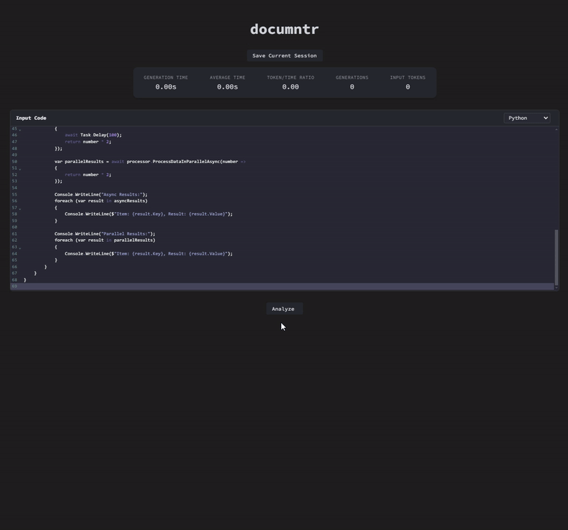

# documntr

documntr is an AI-powered web application that automatically generates documentation for code. It utilizes a React frontend and a Flask backend to provide a seamless documentation experience.



## Prerequisites

- Docker and Docker Compose
- Node.js 16+ (for local frontend development)
- Python 3.9+ (for local backend development)
- OpenAI API key

## Quick Start (Development)

1. Clone the repository:
   ```
   git clone https://github.com/ryan-hernandez/documntr.git
   cd documntr
   ```

2. Set up your environment variables:
   - Create a `.env.dev` file in both the `frontend` and `backend` directories.
   - In `backend/.env.dev`, add:
     ```
     FLASK_APP=app.py
     FLASK_ENV=development
     SECRET_KEY=your_secret_key_here
     OPENAI_API_KEY=your_openai_api_key_here
     ```
   - In `frontend/.env.dev`, add:
     ```
     REACT_APP_API_URL=http://localhost:5000
     ```

3. Build and run the Docker containers:
   ```
   docker-compose -f docker-compose.dev.yml up --build
   ```

4. Open your browser and navigate to `http://localhost:3000` to use the application.

## Debugging

### Backend (Flask)

1. Ensure you have the Python extension installed in VS Code.
2. Set breakpoints in your Python code.
3. In VS Code, go to the Debug view and select "Docker: Python - Flask" from the dropdown.
4. Start debugging.

### Frontend (React)

1. Ensure you have the Chrome Debugger extension installed in VS Code.
2. Set breakpoints in your JavaScript code.
3. In VS Code, go to the Debug view and select "Docker: Node.js" from the dropdown.
4. Start debugging.

You can also use the browser's developer tools to debug the frontend application.

## Project Structure

- `/frontend`: React frontend application
- `/backend`: Flask backend application
- `docker-compose.dev.yml`: Docker Compose configuration for development

For more detailed instructions, see the README files in the `frontend` and `backend` directories.

## License

© Ryan Hernandez 2024. All rights reserved.
